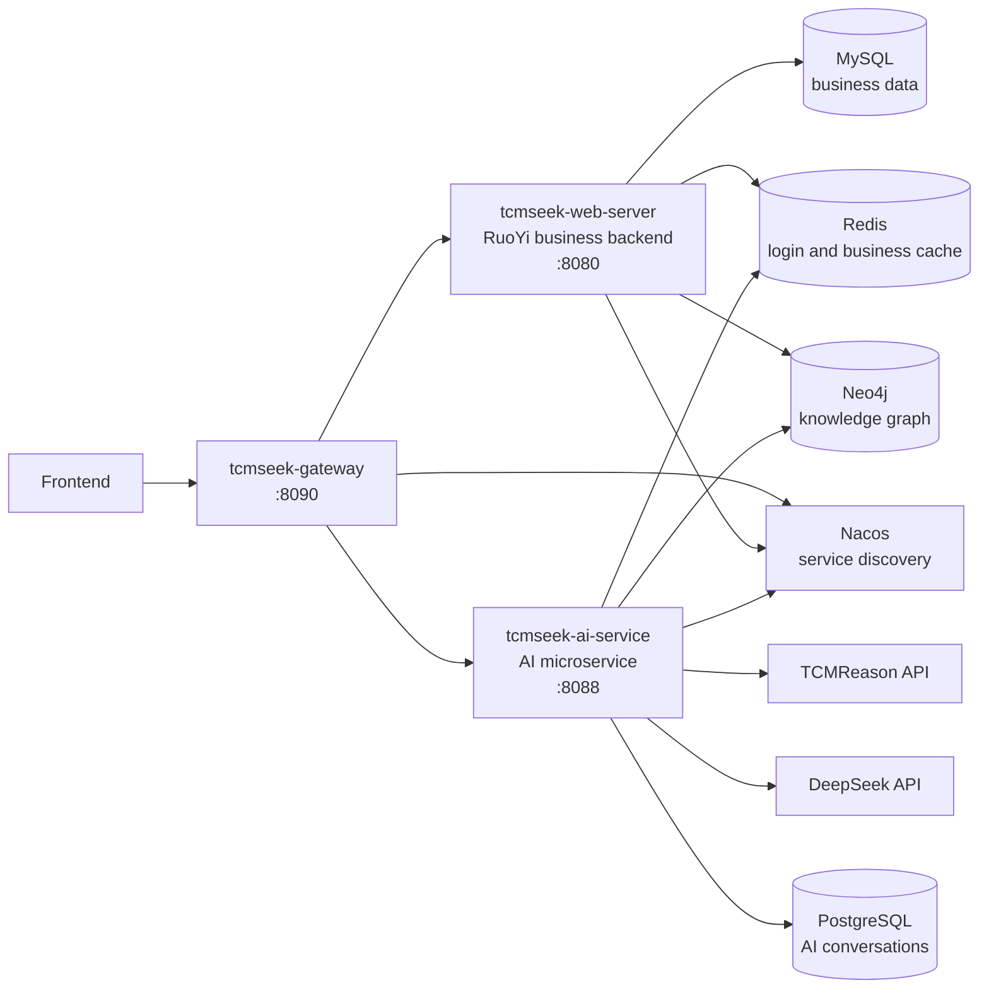

<div align="center">

# TCMSeek Backend

Backend services for Traditional Chinese Medicine data retrieval, knowledge graph exploration, and AI-assisted analysis.

[Chinese Documentation](README.zh-CN.md)


</div>

## Overview

TCMSeek Backend is a service-oriented backend system for a Traditional Chinese Medicine data platform. It combines a RuoYi-based business backend, a standalone AI microservice, and a Spring Cloud Gateway entry point to support data management, user-facing search, knowledge graph queries, AI Q&A, conversation history, and CSV export.

## Demo

Demo link: [http://120.79.220.11/#/](http://120.79.220.11/#/)

The project is designed around three peer services:

| Service | Role | Default Port |
| --- | --- | --- |
| `tcmseek-web-server` | Business backend based on the RuoYi open-source framework | `8080` |
| `tcmseek-ai-service` | AI Q&A service with TCMReason, DeepSeek, Neo4j tools, PostgreSQL storage, and Redis cache | `8088` |
| `tcmseek-gateway` | Unified frontend gateway for routing, token validation, and user context forwarding | `8090` |

## Architecture



## Feature Highlights

| Area | Capabilities |
| --- | --- |
| TCM data service | Herbs, compounds, diseases, symptoms, syndromes, prescriptions, and related entities |
| Knowledge graph | Neo4j-based relationship queries across herbs, compounds, targets, diseases, and prescriptions |
| AI Q&A | TCMReason general TCM Q&A, DeepSeek graph tool calling, result summarization, long-result compression |
| Conversation history | User-isolated conversations, messages, tool call records, summaries, and memories |
| CSV export | Large graph query results are summarized in chat and exported through Gateway |
| Gateway access | Frontend APIs are unified under `/api/web/**` and `/api/ai/**` |

## Repository Layout

```text
TCMSeek-Backend/
|-- tcmseek-web-server/    RuoYi-based business backend
|-- tcmseek-ai-service/    AI Q&A microservice
|-- tcmseek-gateway/       Unified gateway service
|-- db_schema/             MySQL and PostgreSQL schema scripts
|-- README.md              English project documentation
`-- README.zh-CN.md        Chinese project documentation
```

### RuoYi-Based Business Backend

`tcmseek-web-server` is developed on top of the RuoYi open-source project. It keeps the system management, permission, framework, quartz, and generator structure from RuoYi, and extends it with TCM data APIs and knowledge graph related capabilities.

| Module | Description |
| --- | --- |
| `tcmseek-admin` | Service entry point, login, authorization, system APIs, and aggregation |
| `tcmseek-web` | User-facing TCM business APIs |
| `tcmseek-webmanage` | Management-side business APIs |
| `tcmseek-system` | Users, roles, menus, dictionaries, logs, and system modules |
| `tcmseek-framework` | Security, configuration, data sources, filters, and exception handling |
| `tcmseek-common` | Shared utilities, annotations, entities, and common response models |
| `tcmseek-quartz` | Scheduled tasks |
| `tcmseek-generator` | Code generation |

## Runtime Dependencies

| Component | Recommended Version | Usage |
| --- | --- | --- |
| JDK | 17 | Local development runtime |
| Maven | 3.8+ | Build and startup |
| Nacos | 2.x | Service discovery |
| MySQL | 8.x | Business data |
| Redis | 5.x+ | Cache, active AI context, temporary CSV results |
| Neo4j | 4.x / 5.x | TCM knowledge graph |
| PostgreSQL | 13+ | AI conversations, messages, summaries, and memories |
| DeepSeek API Key | Apply separately | Graph-assisted Q&A and summarization provider |
| TCMReason API URL | Provided by the lab | General TCM Q&A provider |

## Database Resources

This repository only provides MySQL and PostgreSQL database schema scripts. Complete business data is not published directly in this repository.

For project reproduction, learning, or research testing, contact [23yyxiao@stu.edu.cn](mailto:23yyxiao@stu.edu.cn) to request related data files, including:

- MySQL / PostgreSQL initialization data
- Neo4j graph database dump files

Complete data files are not uploaded to GitHub because of data source authorization constraints. They are provided only for non-commercial learning and research use.

| Database | Responsibility |
| --- | --- |
| MySQL | Business data, user system, admin management data |
| PostgreSQL | AI conversations, messages, tool call records, summaries, memories |
| Redis | Login cache, business cache, active AI context, temporary CSV results |
| Neo4j | TCM knowledge graph nodes and relationships |

## Configuration

The repository provides example configuration files. Use them as templates for local runtime configuration.

```text
tcmseek-web-server/tcmseek-admin/src/main/resources/application-example.yml
  -> tcmseek-web-server/tcmseek-admin/src/main/resources/application.yml

tcmseek-web-server/tcmseek-admin/src/main/resources/application-druid-example.yml
  -> tcmseek-web-server/tcmseek-admin/src/main/resources/application-druid.yml

tcmseek-ai-service/src/main/resources/application-example.yml
  -> tcmseek-ai-service/src/main/resources/application.yml

tcmseek-gateway/src/main/resources/application-example.yml
  -> tcmseek-gateway/src/main/resources/application.yml
```

| Service | Key Configuration |
| --- | --- |
| `tcmseek-web-server/tcmseek-admin` | MySQL, Redis, Neo4j, Nacos, token secret |
| `tcmseek-ai-service` | TCMReason API URL, DeepSeek API key, Neo4j, PostgreSQL, Redis, Nacos |
| `tcmseek-gateway` | Nacos, route rules, authentication allowlist, token validation target |

## Quick Start

Start the required infrastructure first:

```text
Nacos -> MySQL / Redis / Neo4j / PostgreSQL
```

Then start the backend services in this order:

```text
tcmseek-web-server/tcmseek-admin -> tcmseek-ai-service -> tcmseek-gateway
```

### 1. Start Business Backend

```powershell
cd tcmseek-web-server
mvn clean install -DskipTests

cd tcmseek-admin
mvn spring-boot:run
```

Service address:

```text
http://localhost:8080
```

### 2. Start AI Microservice

```powershell
cd tcmseek-ai-service
mvn spring-boot:run
```

Service address:

```text
http://localhost:8088
```

### 3. Start Gateway

```powershell
cd tcmseek-gateway
mvn spring-boot:run
```

Service address:

```text
http://localhost:8090
```

## Gateway API Contract

Frontend applications should access backend services through the gateway.

| Frontend Path | Target | Authentication |
| --- | --- | --- |
| `POST /api/web/tcmseek/login` | `tcmseek-admin /tcmseek/login` | No gateway token required |
| `ANY /api/web/tcmseek/**` | `tcmseek-admin /tcmseek/**` | Public data queries do not require gateway token by default |
| `ANY /api/web/tcmseek/tools/target-prediction/**` | `tcmseek-admin /tcmseek/tools/target-prediction/**` | User token required |
| `POST /api/ai/chat` | `tcmseek-ai-service /ai/chat`, TCMReason general chat | User token required |
| `POST /api/ai/aichat` | `tcmseek-ai-service /ai/aichat`, DeepSeek graph-assisted academic chat | User token required |
| `GET /api/ai/conversations` | `tcmseek-ai-service /ai/conversations` | User token required |
| `GET /api/ai/conversations/{id}/messages` | `tcmseek-ai-service /ai/conversations/{id}/messages` | User token required |
| `PATCH /api/ai/conversations/{id}` | `tcmseek-ai-service /ai/conversations/{id}` | User token required |
| `DELETE /api/ai/conversations/{id}` | `tcmseek-ai-service /ai/conversations/{id}` | User token required |
| `GET /api/ai/exports/{id}` | `tcmseek-ai-service /ai/exports/{id}` | User token required |

After token validation, Gateway forwards trusted user context to downstream services:

```http
X-User-Id
X-User-Name
X-User-Account
X-User-Email
X-Request-Id
```

## Verification

Gateway health check:

```http
GET http://localhost:8090/actuator/health
```

Login:

```http
POST http://localhost:8090/api/web/tcmseek/login
Content-Type: application/json
```

AI Q&A:

```http
POST http://localhost:8090/api/ai/aichat
Authorization: <token>
Content-Type: application/json
```

Conversation history:

```http
GET http://localhost:8090/api/ai/conversations?page=1&pageSize=20
Authorization: <token>
```

CSV export:

```http
GET http://localhost:8090/api/ai/exports/{exportId}
Authorization: <token>
```

## Build Commands

```powershell
# Business backend
cd tcmseek-web-server
mvn clean package -DskipTests

# AI microservice
cd ../tcmseek-ai-service
mvn clean package -DskipTests

# Gateway
cd ../tcmseek-gateway
mvn clean package -DskipTests
```

## Open Source Acknowledgement

The admin management, user permission, system management, and foundational backend structure of `tcmseek-web-server` are based on the RuoYi open-source project. TCMSeek extends this foundation with TCM business APIs, knowledge graph capabilities, AI service integration, and a unified gateway.

Thanks to the RuoYi project and community for the open-source foundation. Usage, distribution, and secondary development of this project should also comply with the license and copyright notices of the original RuoYi project.
