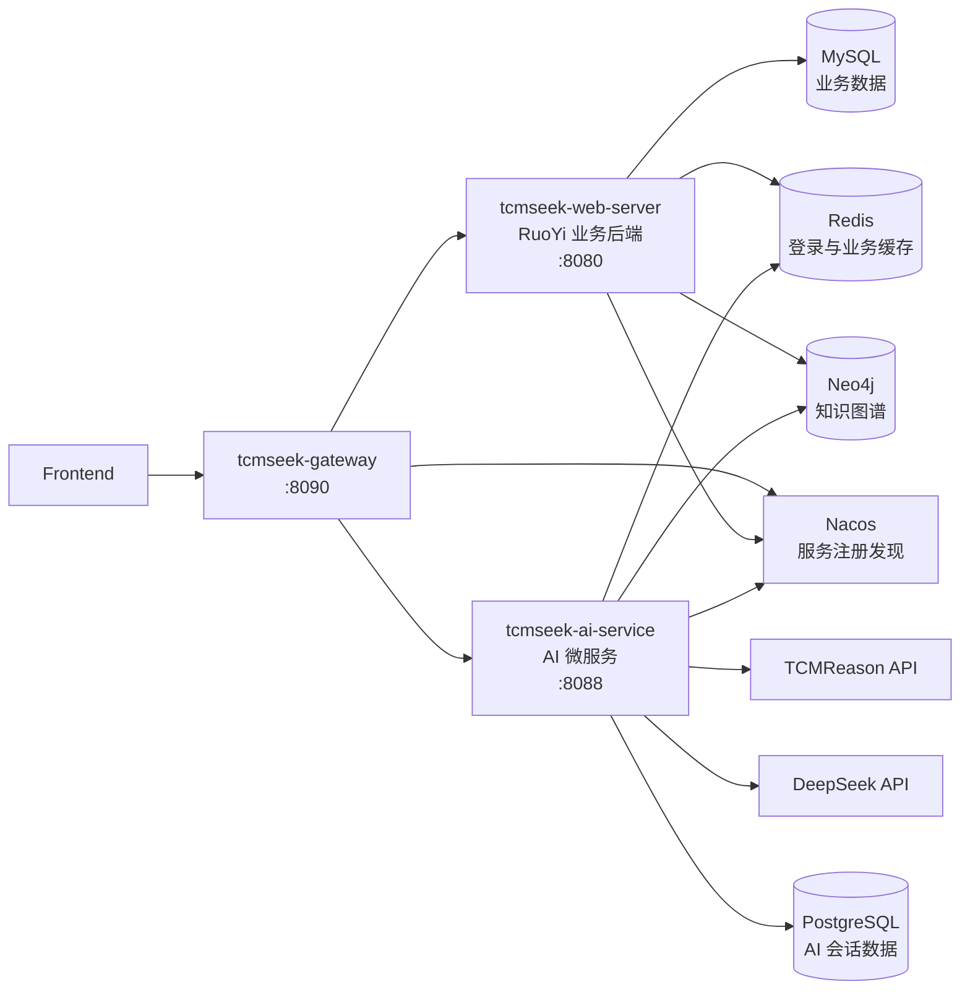

<div align="center">

# TCMSeek Backend

面向中医药数据检索、知识图谱探索与 AI 辅助分析的后端服务工程。

[English Documentation](README.md)


</div>

## 演示地址

演示链接：[http://120.79.220.11/#/](http://120.79.220.11/#/)

## 项目简介

TCMSeek Backend 是中医药数据平台的后端服务工程，提供业务数据管理、用户侧数据检索、知识图谱查询、AI 问答、会话历史、CSV 导出和统一网关能力。

后端由三个平级服务组成：

| 服务 | 定位 | 默认端口 |
| --- | --- | --- |
| `tcmseek-web-server` | 基于 RuoYi 开源框架开发的业务后端服务 | `8080` |
| `tcmseek-ai-service` | 集成 TCMReason、DeepSeek、Neo4j 工具、PostgreSQL 存储和 Redis 缓存的 AI 问答微服务 | `8088` |
| `tcmseek-gateway` | 面向前端的统一网关，负责路由、Token 校验和用户上下文转发 | `8090` |

## 系统架构



## 核心能力

| 方向 | 能力 |
| --- | --- |
| 中医药数据服务 | 中药、化合物、疾病、症状、证候、方剂等基础数据检索 |
| 知识图谱查询 | 基于 Neo4j 查询中药、化合物、靶点、疾病、方剂之间的关系 |
| AI 问答 | TCMReason 通用中医问答、DeepSeek 图谱工具调用、结果摘要、长结果压缩 |
| 会话历史 | 按用户隔离保存会话、消息、工具调用记录、摘要和记忆 |
| CSV 导出 | 大结果在对话中展示摘要，完整明细通过 Gateway 下载 |
| 统一入口 | 前端统一通过 `/api/web/**` 与 `/api/ai/**` 调用后端 |

## 项目结构

```text
TCMSeek-Backend/
|-- tcmseek-web-server/    基于 RuoYi 的业务后端服务工程
|-- tcmseek-ai-service/    AI 问答微服务
|-- tcmseek-gateway/       统一网关服务
|-- db_schema/             MySQL 与 PostgreSQL 建库脚本
|-- README.md              英文项目文档
`-- README.zh-CN.md        中文项目文档
```

### 基于 RuoYi 的业务后端

`tcmseek-web-server` 基于 RuoYi 开源项目开发，保留 RuoYi 的系统管理、权限管理、基础框架、定时任务和代码生成结构，并在此基础上扩展中医药数据接口与知识图谱相关能力。

| 模块 | 说明 |
| --- | --- |
| `tcmseek-admin` | 服务启动入口，提供登录、鉴权、系统接口和业务聚合 |
| `tcmseek-web` | 用户侧中医药业务接口 |
| `tcmseek-webmanage` | 管理侧业务接口 |
| `tcmseek-system` | 用户、角色、菜单、字典、日志等系统模块 |
| `tcmseek-framework` | 安全、配置、多数据源、拦截器、异常处理 |
| `tcmseek-common` | 通用工具、注解、实体和公共返回 |
| `tcmseek-quartz` | 定时任务 |
| `tcmseek-generator` | 代码生成 |

## 运行环境

| 组件 | 建议版本 | 用途 |
| --- | --- | --- |
| JDK | 17 | 本地开发运行环境 |
| Maven | 3.8+ | 构建与启动 |
| Nacos | 2.x | 服务注册发现 |
| MySQL | 8.x | 业务数据 |
| Redis | 5.x+ | 缓存、活跃 AI 上下文、临时 CSV 结果 |
| Neo4j | 4.x / 5.x | 中医药知识图谱 |
| PostgreSQL | 13+ | AI 会话、消息、摘要和记忆 |
| DeepSeek API Key | 自行申请 | 图谱专业问答与摘要供应商 |
| TCMReason API 地址 | 实验室内部提供 | 通用中医问答供应商 |

## 数据库资料

本仓库仅提供 MySQL、PostgreSQL 的数据库建表脚本，完整业务数据未直接随仓库发布。

如需用于项目复现、学习或科研测试，可联系作者获取相关数据文件，包括：

- MySQL / PostgreSQL 初始化数据
- Neo4j 图数据库 dump 文件

联系邮箱：[23yyxiao@stu.edu.cn](mailto:23yyxiao@stu.edu.cn)

说明：完整数据文件因数据来源授权等原因未上传至 GitHub，仅供非商业学习与研究使用。

| 数据库 | 用途 |
| --- | --- |
| MySQL | 业务数据、用户体系、后台管理相关数据 |
| PostgreSQL | AI 会话历史、消息记录、工具调用记录、摘要和长期记忆 |
| Redis | 登录缓存、业务缓存、AI 活跃上下文、CSV 临时结果 |
| Neo4j | 中医药知识图谱节点与关系数据 |

## 配置文件

仓库提供示例配置文件。运行环境配置可基于示例文件生成。

```text
tcmseek-web-server/tcmseek-admin/src/main/resources/application-example.yml
  -> tcmseek-web-server/tcmseek-admin/src/main/resources/application.yml

tcmseek-web-server/tcmseek-admin/src/main/resources/application-druid-example.yml
  -> tcmseek-web-server/tcmseek-admin/src/main/resources/application-druid.yml

tcmseek-ai-service/src/main/resources/application-example.yml
  -> tcmseek-ai-service/src/main/resources/application.yml

tcmseek-gateway/src/main/resources/application-example.yml
  -> tcmseek-gateway/src/main/resources/application.yml
```

| 服务 | 重点配置 |
| --- | --- |
| `tcmseek-web-server/tcmseek-admin` | MySQL、Redis、Neo4j、Nacos、Token secret |
| `tcmseek-ai-service` | TCMReason API 地址、DeepSeek API Key、Neo4j、PostgreSQL、Redis、Nacos |
| `tcmseek-gateway` | Nacos、路由规则、鉴权白名单、Token 校验目标服务 |

## 快速启动

先启动基础设施：

```text
Nacos -> MySQL / Redis / Neo4j / PostgreSQL
```

再按顺序启动后端服务：

```text
tcmseek-web-server/tcmseek-admin -> tcmseek-ai-service -> tcmseek-gateway
```

### 1. 启动业务后端

```powershell
cd tcmseek-web-server
mvn clean install -DskipTests

cd tcmseek-admin
mvn spring-boot:run
```

服务地址：

```text
http://localhost:8080
```

### 2. 启动 AI 微服务

```powershell
cd tcmseek-ai-service
mvn spring-boot:run
```

服务地址：

```text
http://localhost:8088
```

### 3. 启动 Gateway

```powershell
cd tcmseek-gateway
mvn spring-boot:run
```

服务地址：

```text
http://localhost:8090
```

## Gateway 接口约定

Frontend 应通过 Gateway 访问后端服务。

| 前端路径 | 转发目标 | 鉴权 |
| --- | --- | --- |
| `POST /api/web/tcmseek/login` | `tcmseek-admin /tcmseek/login` | 不需要 Gateway Token |
| `ANY /api/web/tcmseek/**` | `tcmseek-admin /tcmseek/**` | 普通数据查询默认不需要 Gateway Token |
| `ANY /api/web/tcmseek/tools/target-prediction/**` | `tcmseek-admin /tcmseek/tools/target-prediction/**` | 需要用户 Token |
| `POST /api/ai/chat` | `tcmseek-ai-service /ai/chat`，TCMReason 通用问答 | 需要用户 Token |
| `POST /api/ai/aichat` | `tcmseek-ai-service /ai/aichat`，DeepSeek 图谱专业问答 | 需要用户 Token |
| `GET /api/ai/conversations` | `tcmseek-ai-service /ai/conversations` | 需要用户 Token |
| `GET /api/ai/conversations/{id}/messages` | `tcmseek-ai-service /ai/conversations/{id}/messages` | 需要用户 Token |
| `PATCH /api/ai/conversations/{id}` | `tcmseek-ai-service /ai/conversations/{id}` | 需要用户 Token |
| `DELETE /api/ai/conversations/{id}` | `tcmseek-ai-service /ai/conversations/{id}` | 需要用户 Token |
| `GET /api/ai/exports/{id}` | `tcmseek-ai-service /ai/exports/{id}` | 需要用户 Token |

Gateway 校验 Token 后会向下游服务注入可信用户头：

```http
X-User-Id
X-User-Name
X-User-Account
X-User-Email
X-Request-Id
```

## 本地验收

Gateway 健康检查：

```http
GET http://localhost:8090/actuator/health
```

登录获取 Token：

```http
POST http://localhost:8090/api/web/tcmseek/login
Content-Type: application/json
```

调用 AI 问答：

```http
POST http://localhost:8090/api/ai/aichat
Authorization: <token>
Content-Type: application/json
```

查看历史对话：

```http
GET http://localhost:8090/api/ai/conversations?page=1&pageSize=20
Authorization: <token>
```

下载 CSV：

```http
GET http://localhost:8090/api/ai/exports/{exportId}
Authorization: <token>
```

## 构建命令

```powershell
# 业务后端
cd tcmseek-web-server
mvn clean package -DskipTests

# AI 微服务
cd ../tcmseek-ai-service
mvn clean package -DskipTests

# Gateway
cd ../tcmseek-gateway
mvn clean package -DskipTests
```

## 开源致谢

`tcmseek-web-server` 的后台管理、用户权限、系统管理和基础工程结构基于 RuoYi 开源项目开发。TCMSeek 在此基础上扩展了中医药业务接口、知识图谱相关能力、AI 服务接入和 Gateway 统一入口。

感谢 RuoYi 项目及其社区提供的开源基础。本项目的使用、分发和二次开发应同时遵守 RuoYi 原项目的开源协议与版权声明。
